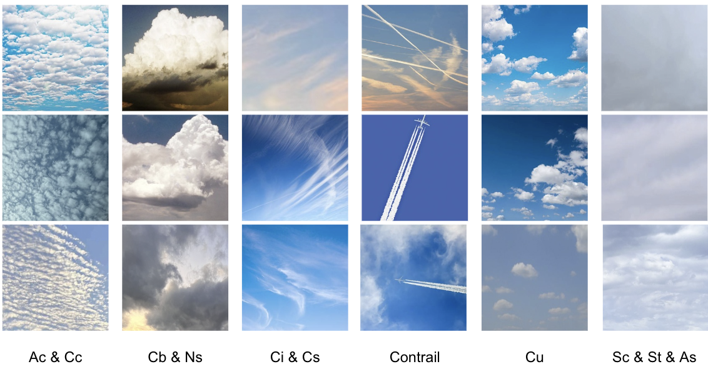

# Ground-Based-Cloud-Dataset

This dataset encompasses 6 subfolders of cloud images with the following labels:
1. Ac & Cc : Altocumulus (AC) and Cirrocumulus (Cc)
2. Cb & Ns : Cumulonimbus (Cb) and Nimbostratus (Ns)
3. Ci & Cs : Cirrus (Ci) and Cirrostratus (Cs)
4. Contrail clouds
5. Cu: Cumulus (Cu)
6. Sc & St & As: Stratocumulus (Sc), Stratus (St), and Altostratus (As)

The images are all of 256*256 pixels. Part of the dataset is retrieved and processed from the CCSN dataset: https://github.com/upuil/CCSN-Database.

Example of images:

### Contribution
This dataset is majorly collected by the author. Contact via email: yaoyi2000326@gmail.com
